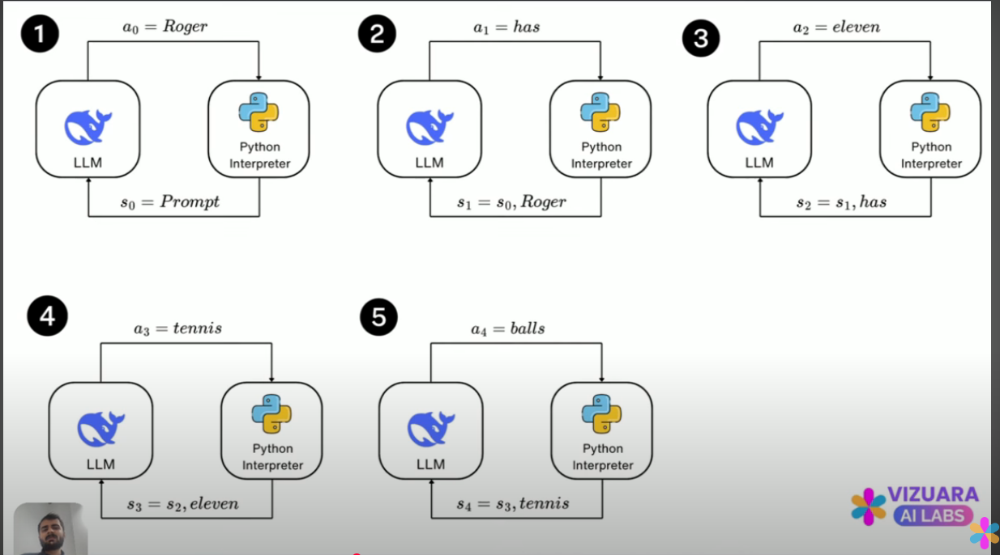
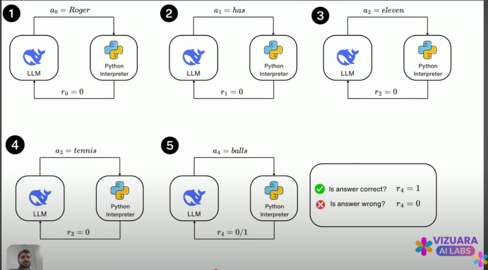
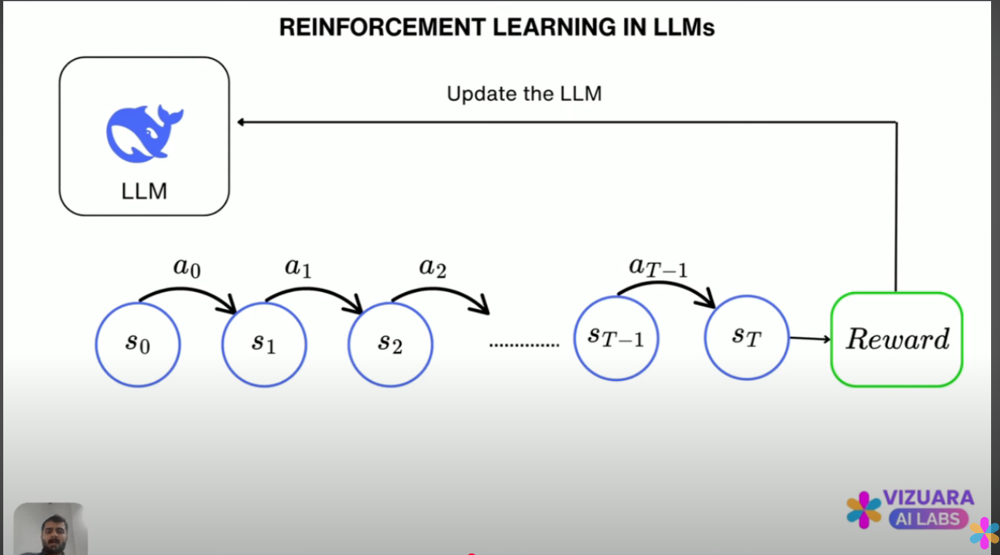
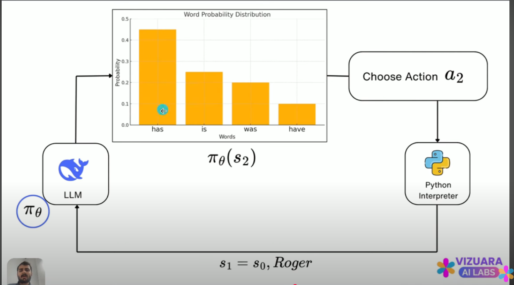
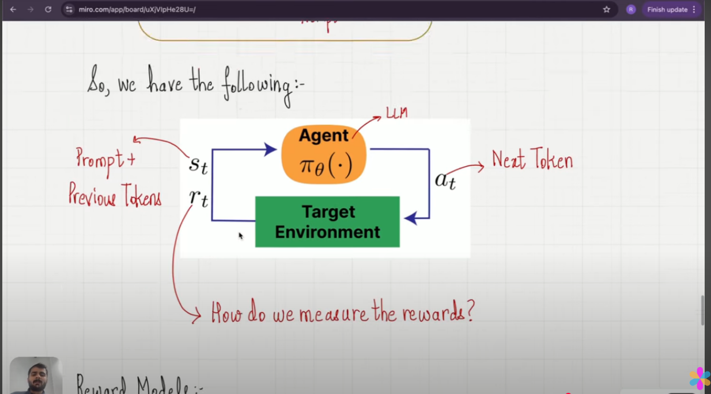
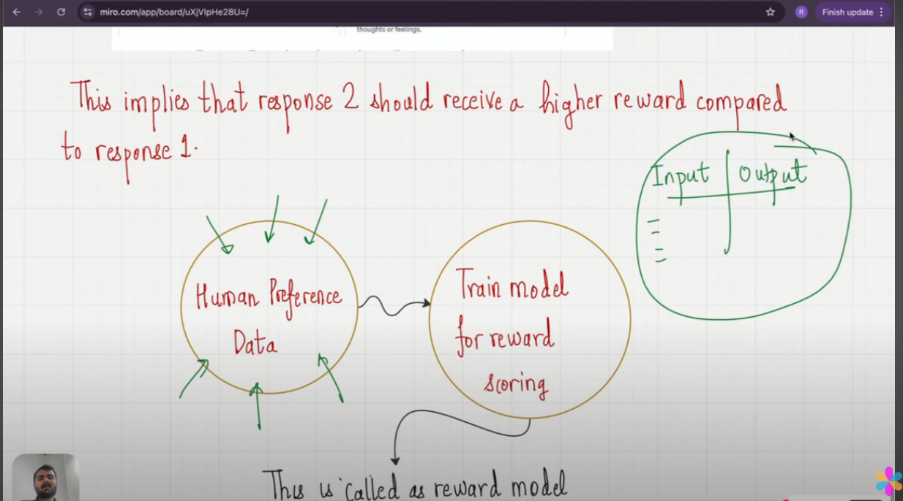
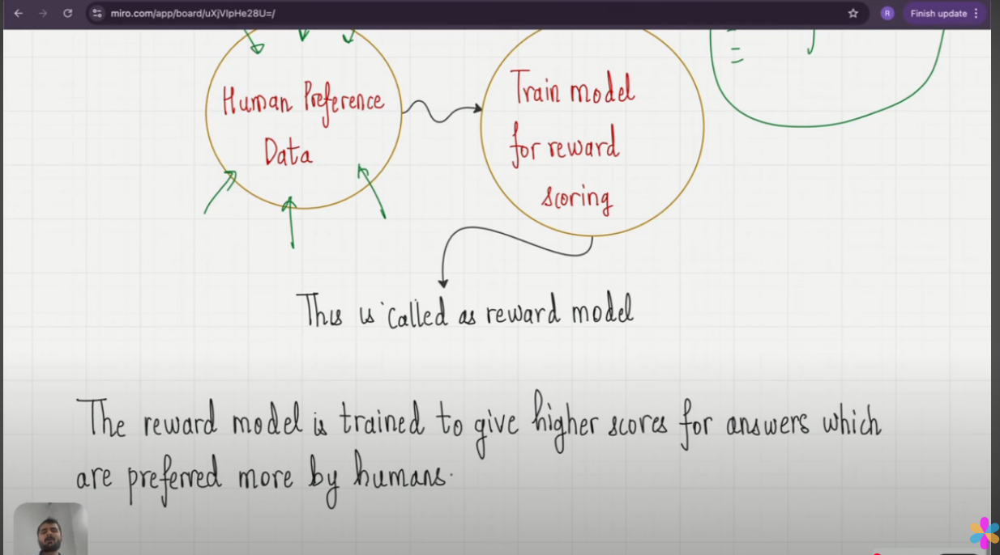
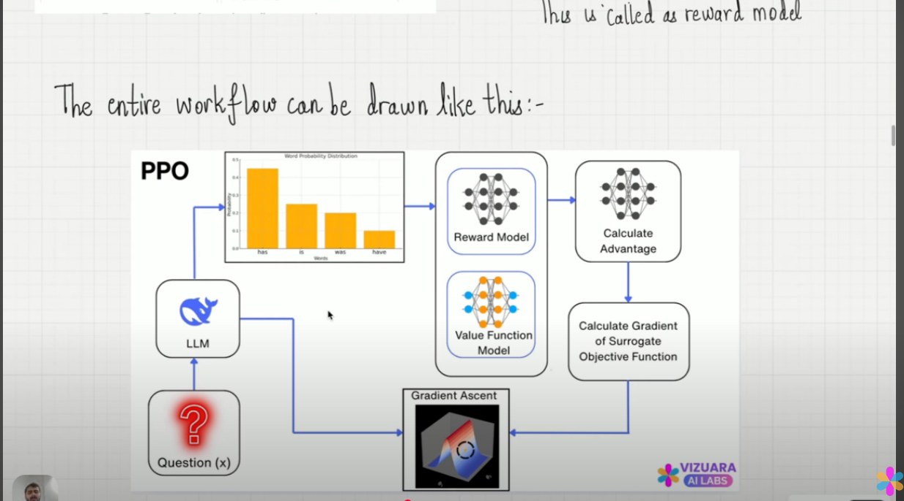

# Description
the agent is the llm itself 
the action is the is the next word in the sequence of tokens 
the reward is 1 for a correct response and 0 for a incorrect response; this denotes the coherency of the action given the input state
the policy is the probability of taking an action for the current state of the agent

  
  
  
  
  
  
  
  

The state of the current iteration i are the tokens completed by the LLM up until i and action is the next token or next word that the LLM is predicting
s0 is always the prompt 
a0 is the subject of the prompt 
sN is always the aN of the previous state 
Likewise, aN is always what the LLM receives in the prompt for the next iteration

LLMs are models that give the probability of the next given token

# TODO
The model is currently under-trained and under-powered; output currently has the <UNK> tokens
Why the Model Behaves Like This

Tokenizer is word-level and coarse

Every out-of-vocab token becomes <UNK>. That’s why your input “Milky Way” becomes <UNK> the <UNK> way.

With only ~3,300 vocab tokens, it just doesn’t capture enough.

Training corpus may not align with your goal

If most of the text is story-like (e.g. Project Gutenberg books), the model learns to talk about “doctors, kings, monkeys” rather than science.

Small model capacity

d_model=384, 6 layers, 6 heads, ~30–40M params → too small for rich reasoning tasks like explaining astronomy.

Training regime was shallow

Likely just LM objective, a few epochs. No fine-tuning on Q&A or reasoning datasets, so chain-of-thought prompts don’t land.

🚀 Steps to Improve Performance
A. Fix Tokenization

Replace your word-level tokenizer with subword BPE/WordPiece (e.g. HuggingFace’s tokenizers library).

This eliminates <UNK> and handles rare words like “Milky” smoothly.

You’ll retrain vocab (~20k–50k tokens) from your corpus.

B. Expand Model Size

Go larger: at least d_model=768, 12 layers, 12 heads (~110M params).

Still small compared to GPT-style, but a big jump in expressive power.

C. Train Longer & Better

Current training script is limited: 5 epochs, small batch size.

Increase:

epochs (20–50+ depending on corpus size),

batch size (if GPU allows),

sequence length (up to 1024+).

Use gradient accumulation if GPU memory is tight.

D. Train on the Right Data

Add corpora relevant to your goals:

Wikipedia, textbooks, Q&A data for science/math.

Reasoning-specific datasets: GSM8K, AQuA, StrategyQA (chain-of-thought style).

Clean/remove noisy text (random Project Gutenberg chatter isn’t helpful).

E. Fine-Tune for Reasoning

After pretraining, fine-tune on reasoning traces:

Q: What is the Milky Way?
Reasoning: The Milky Way is a barred spiral galaxy. It appears as a band of stars in the night sky because we live inside it.
Answer: It is the galaxy containing our Solar System.

Even a few thousand high-quality examples boosts performance.

F. Improve Inference

You already added CoT + self-consistency.

Next steps:

Use temperature decay (higher at first, lower later).

Add length penalty in beam search to avoid loops.

Post-process to strip <START>/<END>/<UNK> tokens.

📈 Roadmap for You

Short-term (days)

Switch to BPE tokenizer → retrain vocab.

Re-train your model with more diverse data.

Strip <UNK> from outputs (decode cleanup).

Medium-term (weeks)

Scale model (d_model=768, 12L).

Train longer on a larger, mixed corpus.

Fine-tune with reasoning/Q&A datasets.

Long-term (months)

Add external tools (math, search) to inference.

Implement retrieval-augmented training (RAG) for factual grounding.

Explore reinforcement fine-tuning for reasoning quality.