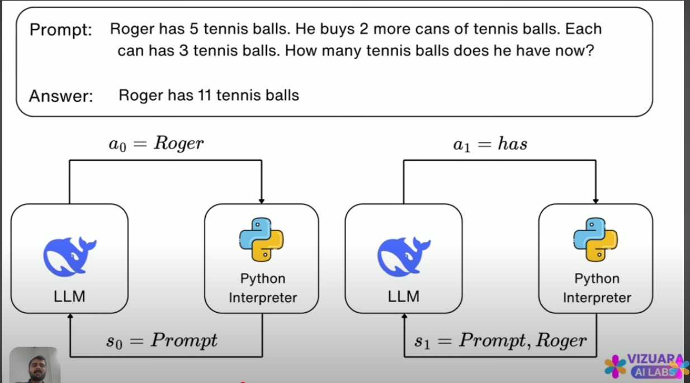

the agent is the llm itself 
the action is the is the next word in the sequence of tokens 
the reward is 1 for a correct response and 0 for a incorrect response; this denotes the coherency of the action given the input state
the policy is the probability of taking an action for the current state of the agent

![How to apply RL to LLMs] (screenshots/Screenshot_20250811_150409.png)
![How to apply RL to LLMs] (screenshots/Screenshot_20250811_151058.png)
![How to apply RL to LLMs] (screenshots/Screenshot_20250811_151208.png)
![How to apply RL to LLMs] (screenshots/Screenshot_20250811_151608.png)
![How to apply RL to LLMs] (screenshots/Screenshot_20250811_151730.png)
![How to apply RL to LLMs] (screenshots/Screenshot_20250811_152048.png)
![How to apply RL to LLMs] (screenshots/Screenshot_20250811_152122.png)

The state of the current iteration i are the tokens completed by the LLM up until i and action is the next token or next word that the LLM is predicting
s0 is always the prompt 
a0 is the subject of the prompt 
sN is always the aN of the previous state 
Likewise, aN is always what the LLM receives in the prompt for the next iteration

LLMs are models that give the probability of the next given token